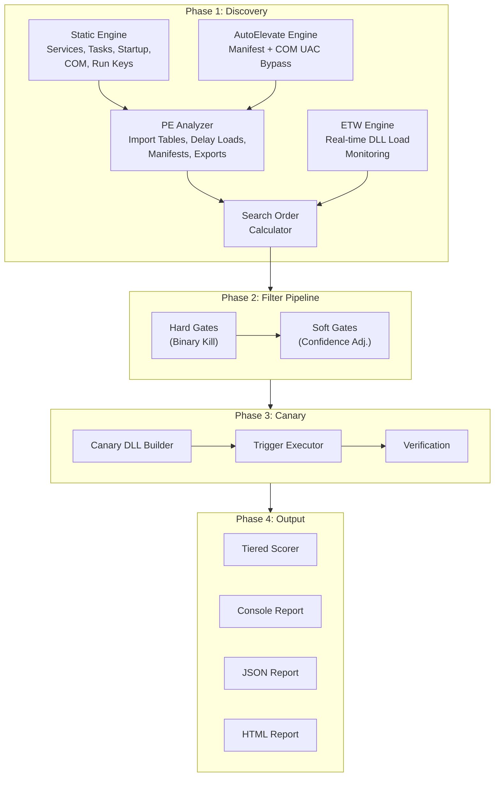
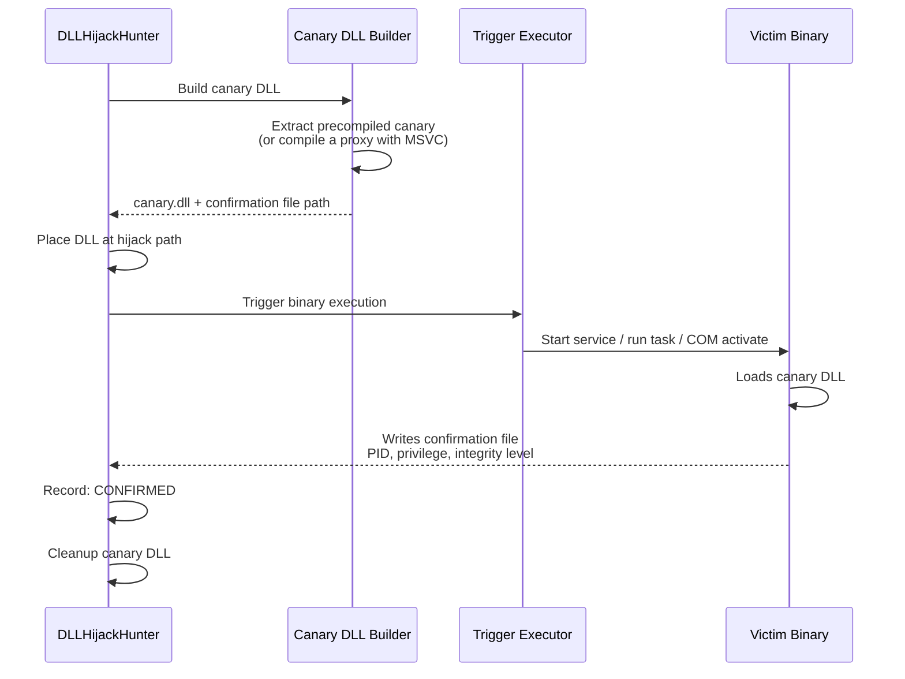

<p align="center">
  
  
  
  
</p>

<h1 align="center">DLLHijackHunter</h1>
<h4 align="center">By GhostVector Academy</h4>

<p align="center">
  <strong>Automated DLL Hijacking Discovery, Validation, and Confirmation</strong><br/>
  <em>Turning local misconfigurations into weaponized, confirmed attack paths.</em>
</p>

---

## Overview

**DLLHijackHunter** is an automated Windows DLL hijacking detection tool that goes beyond static analysis. It discovers, validates, and confirms DLL hijacking opportunities using a multi-phase pipeline:

1. **Discovery** — Enumerates binaries across services, scheduled tasks, startup items, COM objects, and AutoElevate UAC bypass vectors
2. **Filtration** — Eliminates false positives through intelligent hard and soft gates
3. **Canary Confirmation** — Deploys a harmless canary DLL and triggers the binary to prove the hijack works
4. **Scoring & Reporting** — Ranks findings by exploitability with a tiered confidence system

> Most DLL hijacking tools stop at “this DLL might be hijackable.” DLLHijackHunter attempts to validate it, cross-reference it against known exploit intelligence, and confirm real execution paths where possible.

---

## Architecture



---

## Key Features

### Hijack Type Coverage

| Type | Description | Stealth | Status |
|---|---|---|---|
| **Phantom** | DLL doesn't exist anywhere on disk | High | Implemented |
| **Search Order** | Place DLL earlier in the Windows search order | High | Implemented |
| **Side-Loading** | Abuse legitimate app loading DLLs from its directory | High | Implemented (AutoElevate copy-to-temp path) |
| **.local Redirect** | Hijack via `.local` directory redirection | High | Implemented |
| **ENV PATH** | Weaponization of writable directories in system `PATH` | High | Implemented (curated service/DLL map) |
| **AppInit DLLs** | `AppInit_DLLs` registry abuse | Low | Implemented |
| **AppCert DLLs** | `AppCertDLLs` registry abuse (loads into every `CreateProcess`/`WinExec` caller) | Low | Implemented |
| **CWD** | Current Working Directory hijack | Low | Planned — not currently produced by any discovery path |

> IFEO Debugger entries are enumerated and the referenced binary is analyzed for DLL imports, but there is no dedicated IFEO/KnownDLL-bypass hijack type — those are not advertised as standalone detections.

### UAC Bypass Discovery

DLLHijackHunter includes dedicated UAC bypass discovery:

- **Manifest AutoElevate** — Scans `System32` and `SysWOW64` for EXEs with `<autoElevate>true</autoElevate>` in embedded manifests
- **COM AutoElevation** — Scans `HKLM\SOFTWARE\Classes\CLSID` for COM objects with `Elevation\Enabled=1`
- **Side-Load Simulation** — For AutoElevate binaries that do not call `SetDllDirectory` or `SetDefaultDllDirectories`, simulates the “copy EXE to writable folder + drop DLL” attack path

### Targeted Vulnerability Knowledge Base

- **Targeted vulnerability mapping** — Cross-references discovered imports against a **bundled snapshot of the [HijackLibs](https://hijacklibs.net/) dataset** (≈590 documented DLL entries spanning ≈700 vulnerable executables), embedded as `Resources/hijacklibs.json`. A match boosts confidence and links the finding to its HijackLibs reference page; the absence of a match means nothing. The dataset is data-driven — refresh it by re-downloading `https://hijacklibs.net/api/hijacklibs.json` over that resource (no code changes required). Dataset © the HijackLibs project and contributors.
- **Automated PATH exploitation** — Evaluates writable `PATH` folders and generates hijack candidates for a curated map of native Windows services known to search `PATH` for missing DLLs
- **Expanded phantom DLL hunting** — Searches for a library of high-value phantom DLL opportunities across multiple categories

### Filter Pipeline

The pipeline reduces false positives through two stages:

**Hard Gates**
- API set schema filtering (`api-ms-*`, `ext-ms-*`)
- KnownDLL filtering
- **Attacker-relative** ACL writability validation — a path counts as writable only if an *unprivileged* principal (`Users` / `Authenticated Users` / `Everyone`, plus leak-proof sub-admin service accounts like `LOCAL SERVICE`/`NETWORK SERVICE`) has effective write rights. Crucially, this is computed independently of the token the tool runs under, so running elevated does **not** make `System32`/`Program Files` look writable. This is what makes elevated runs meaningful for LPE triage.

**Soft Gates**
- WinSxS manifest penalty
- Privilege delta analysis
- `LoadLibraryEx` mitigation checks
- Signature validation checks
- Graceful error-handling penalties

---

## Canary Confirmation

Instead of guessing, DLLHijackHunter attempts to prove hijacks work:



The canary DLL:
- Ships **precompiled for both x64 and x86**, embedded in the scanner, so **no compiler is required at scan time**. The correct architecture is selected to match the victim's bitness and extracted on demand.
- Is **self-locating**: it derives its confirmation-file path at runtime from its own loaded module path (`%ProgramData%\DLLHijackHunter\canary_<hash>.confirm`), so one binary serves every candidate. The scanner computes the same hash from the deploy path and polls for that file.
- Uses a **file-based confirmation mechanism**
- Captures execution metadata such as user, integrity level, and privilege indicators
- Contains no malicious payload; it is strictly a detection and validation mechanism
- Statically links the CRT, so it has **no runtime dependency** (ucrtbase/vcruntime) on the victim host.

The bundled binaries are built from the auditable source at `src/DLLHijackHunter/Resources/canary_src.c` and can be regenerated with `Resources/build_canary.bat` (requires the MSVC C++ toolchain; the scanner does **not**).

> **Functional-proxy exception:** When a search-order hijack targets a DLL that *exists* and exposes exports, keeping the host alive after confirmation requires an export-forwarding **proxy**, which is compiled per-DLL with MSVC (`cl.exe`, located via `vswhere`/`vcvarsall`). If no toolchain is present, the precompiled canary is used instead — it still **confirms the load** (DllMain fires) but does not forward exports, so the host process may crash after the confirmation is recorded. Phantom-DLL and other no-export candidates need no compiler at all.

> **Signing:** The embedded canaries are unsigned. Code-signing them (so they load under stricter policies and are attributable) requires a signing certificate and is left as a release-time step for the maintainer.

### Important note on proxy/export-forwarding mode

Proxy/export-forwarding canaries are **experimental** and **best-effort**. Some targets may fail to load correctly or may behave unexpectedly depending on:

- ordinal-only exports
- decorated export names
- calling convention mismatches
- loader/runtime assumptions in the target process

That means a failed proxy canary does **not always** mean the underlying hijack path is impossible.

---

## Comparison

| Feature | **DLLHijackHunter** | Robber | DLLSpy | WinPEAS | Procmon |
|---|:---:|:---:|:---:|:---:|:---:|
| Automated discovery | ✅ | ✅ | ✅ | ✅ | ❌ |
| Phantom DLL detection | ✅ | ❌ | ✅ | ❌ | ✅ |
| Search order analysis | ✅ | ❌ | ❌ | ❌ | ❌ |
| ACL-based writability check | ✅ | Partial | ❌ | Basic | ❌ |
| ETW real-time monitoring | ✅ | ❌ | ❌ | ❌ | ✅ |
| Canary confirmation | ✅¹ | ❌ | ❌ | ❌ | ❌ |
| Privilege escalation check | ✅ | ❌ | ❌ | ❌ | ❌ |
| UAC bypass discovery | ✅ | ❌ | ❌ | ❌ | ❌ |
| False positive reduction | ✅² | None | Basic | None | None |
| Reboot persistence check | ✅³ | ❌ | ❌ | ❌ | ❌ |
| Proxy DLL generation | ✅⁴ | ❌ | ❌ | ❌ | ❌ |
| Confidence scoring | ✅ | ❌ | ❌ | ❌ | ❌ |
| Auto trigger (svc/task/COM) | ✅⁵ | ❌ | ❌ | ❌ | ❌ |
| HTML/JSON reporting | ✅ | ❌ | ❌ | TXT | ❌ |
| Threat intel correlation | ✅⁶ | ❌ | ❌ | ❌ | ❌ |
| Automated PATH exploits | ✅ | ❌ | ❌ | ❌ | ❌ |
| Target-specific scanning | ✅ | ❌ | ❌ | ❌ | ✅ |
| Self-contained binary | ✅ | ❌ | ❌ | ✅ | ❌ |

<sub>
¹ Precompiled dual-arch canaries are embedded — **no compiler needed** to confirm a load. Only the optional export-forwarding *proxy* (to keep an export-consuming host alive) needs MSVC.<br/>
² Via attacker-relative ACL writability (see Filter Pipeline). It reduces — it does not eliminate — false positives; soft-gate heuristics (manifest/SxS/LoadLibraryEx) still carry uncertainty. Unverified static findings are now capped below the **High** tier.<br/>
³ Derived from auto-start status, not a verified reboot test.<br/>
⁴ Export-forwarding proxy is experimental/best-effort (see note above).<br/>
⁵ Service/Task/COM triggers only; UAC-bypass findings are not canary-triggered.<br/>
⁶ Backed by a bundled snapshot of the HijackLibs dataset (~590 entries); refreshable from hijacklibs.net.
</sub>

---

## Usage

### Prerequisites

- **Windows 10/11** or **Windows Server 2016+**
- **.NET 8.0 Runtime** (or use a self-contained build)
- **Administrator privileges** recommended (required for ETW, canary deployment, and some service triggers)

### Build

```powershell
git clone https://github.com/ghostvectoracademy/DLLHijackHunter.git
cd DLLHijackHunter

# Build (self-contained single file)
dotnet publish src/DLLHijackHunter/DLLHijackHunter.csproj `
    -c Release -r win-x64 --self-contained `
    -p:PublishSingleFile=true -o ./publish

# Or use the build script
.\build.ps1
```

### Quick Start

```powershell
# Full aggressive scan (recommended, requires admin)
.\DLLHijackHunter.exe --profile aggressive

# Safe scan (no file drops, no triggers)
.\DLLHijackHunter.exe --profile safe

# UAC bypass focused scan
.\DLLHijackHunter.exe --profile uac-bypass

# Target a specific binary
.\DLLHijackHunter.exe --target "C:\Program Files\MyApp\app.exe"

# Target by filename (partial match)
.\DLLHijackHunter.exe --target notepad.exe

# Confirmed findings only
.\DLLHijackHunter.exe --profile redteam --format json -o report.json
```

### CLI Options

```text
DLLHijackHunter — Automated DLL Hijacking Detection

Options:
  -p, --profile <profile>        Scan profile [default: aggressive]
                                   aggressive | strict | safe | redteam | uac-bypass
  -o, --output <path>            Output file path (auto-detects format)
  -f, --format <format>          Output format [default: console]
                                   console | json | html
  -t, --target <target>          Target specific binary, directory, or filename
      --min-confidence <value>   Minimum confidence threshold 0-100. When omitted, each
                                   profile's own threshold applies; passing this overrides it.
      --no-canary                Disable canary confirmation
      --no-etw                   Disable ETW runtime discovery
      --confirmed-only           Only show canary-confirmed findings
      --lpe-only                 Strict LPE hunting: ignore System32/Program Files, show
                                   only standard-user-writable vulnerabilities
      --log-file <path>          Write a diagnostic scan log to file
  -v, --verbose                  Verbose output
```

> Note: `--min-confidence` is only treated as an override when you explicitly pass it. Otherwise the selected profile's threshold is used (e.g. `safe` = 50%, `strict` = 80%).

### Scan Profiles

| Profile | Use Case | Canary | ETW | UAC Bypass | Min Confidence | Triggers |
|---|---|:---:|:---:|:---:|:---:|---|
| **aggressive** | Full audit, lab environments | ✅ | ✅ | ✅ | 15% | Services, Tasks, COM |
| **strict** | High-confidence findings only | ✅ | ✅ | ❌ | 80% | Services, Tasks |
| **safe** | Production systems, read-only | ❌ | ❌ | ❌ | 50% | None |
| **redteam** | Confirmed exploitable only | ✅ | ✅ | ❌ | 50% | Services, Tasks, COM |
| **uac-bypass** | UAC bypass vectors only | ❌ | ❌ | ✅ | 20% | AutoElevate only |

---

## Scoring

Each finding receives confidence and impact signals that are combined into a final prioritization tier.

Typical impact considerations include:
- privilege gained
- trigger reliability
- stealth
- reboot persistence

Confirmed canary execution should be treated as the strongest validation signal.

**Tier gating:** the **High** and **Confirmed** tiers are reserved for findings backed by a proof signal — a fired canary, an ETW runtime load observation, or a documented knowledge-base match. A purely static search-order match, however clean, is capped at the top of the **Medium** tier and annotated as `Static-only` so unverified heuristics never present as high-confidence.

### Recommended triage configuration

Because writability is evaluated **attacker-relative**, both elevated and standard-user runs are meaningful:

- For LPE triage, the most trustworthy configuration is a **standard-user run with `--lpe-only`** (and `--no-canary` if a compiler isn't available) — every surviving finding is genuinely writable by an unprivileged principal.
- Elevated runs are required for ETW and canary confirmation, and are now safe from the historical "everything in System32 looks writable" inversion.

---

## Safety

DLLHijackHunter is designed for defensive security research, lab validation, auditing, and red-team simulation in authorized environments.

Use it only on systems and networks you own or are explicitly authorized to assess.

### Operational notes

- Canary mode writes test DLLs to candidate locations
- Some triggers may briefly start or stop services/tasks during validation
- Proxy/export-forwarding canaries may destabilize fragile targets
- Safe profile is the preferred mode for production triage when file drops and triggers are not acceptable

---

## Output

DLLHijackHunter supports:
- console reporting
- JSON export
- HTML export

Recommended workflow:
1. run a broad scan
2. review high-confidence findings
3. use canary confirmation selectively on high-value paths
4. preserve JSON/HTML output for reporting and triage

---

## License

MIT

---

## Credits

Built by **GhostVector Academy**.
